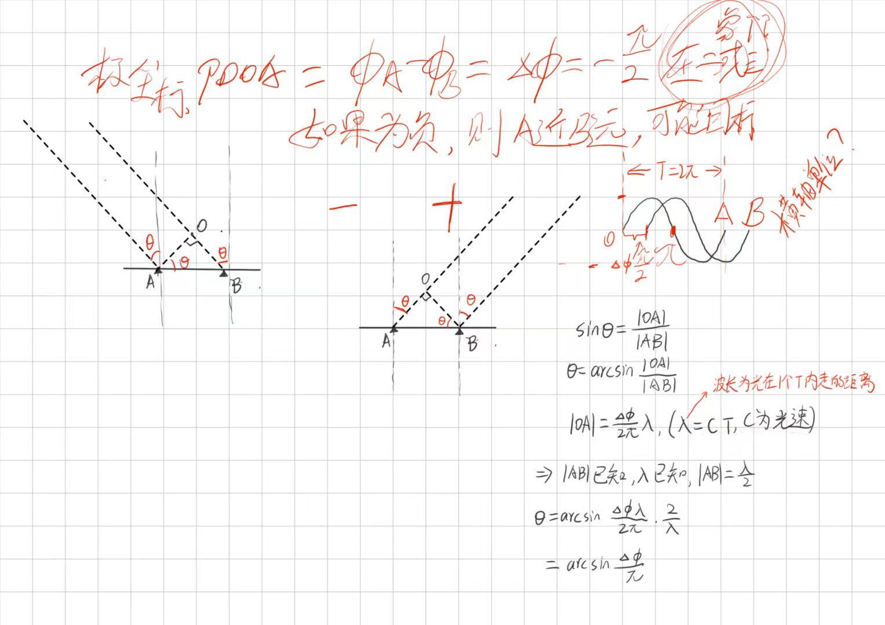
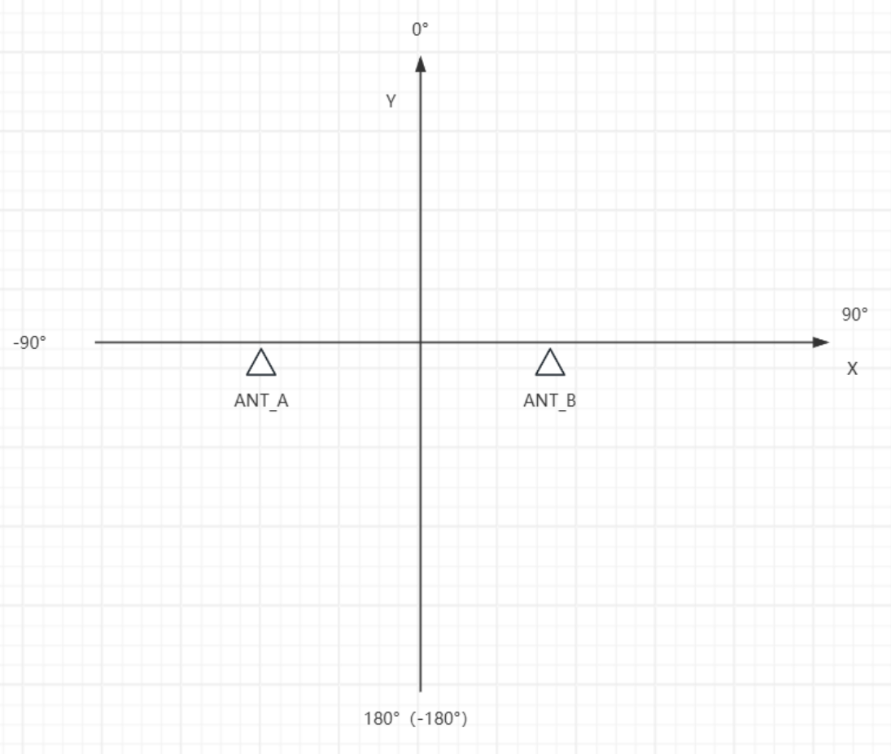
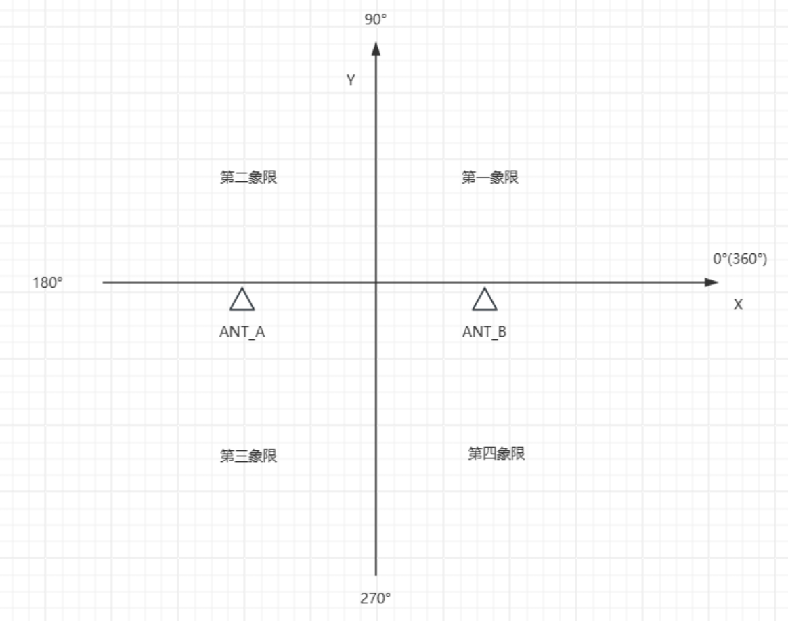
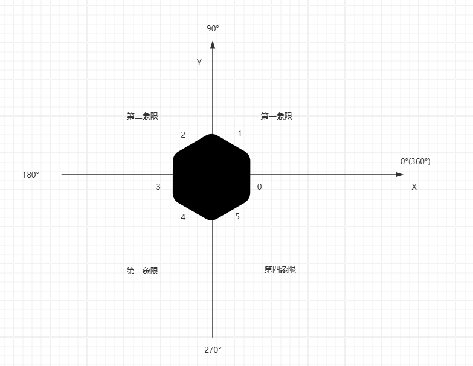

# 基于 UWB 的 360 基站多天线融合测向

## 理论基础

---

对于一个包含多个天线的基站， 测向的测量结果可以由多个天线的测量结果进行融合得到。

其中，单个天线通过板面上的两个馈线来接收目标的信号， 通过获取两个反馈信号的相位差 pdoa 并根据以下公式得到当前天线的测向结果。

对于一个 pdoa 存在天线正面和反面两个可能的真实位置，因此计算得到的 aoa 要进一步推算两种可能位置下的角度  

即 n 个天线的基站，在单次测量中最多得到 2n 种角度。问题转化为在 2n 种角度中，筛选出有效值并融合得到最终的测量角度

### 0. 角度校准

校准各个天线，得到校准值（offset、scale），对天线的输出值进行较准

### 1. 坐标系转换

单个天线计算得到的角度 aoa 为当前天线坐标系（ant_coordinate）下的结果

要将该角度转化为设备极坐标系（device_coordinate）下的角度，坐标系定义如下，

其转化公式为 ( -aoa + 面 id * 360 / 天线面数 + 360 ) % 360

例：对于 6 天线设备，坐标系及天线的相对位置定义如下，

### 2. 筛选测量结果

### 3. 角度加权融合

a. 角度范围  
b. 流逝时间  
c. 角密度
d. 历史结果
e. 信号强度

## 算法思路

---

## 代码实现

